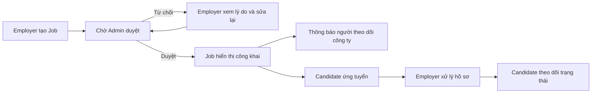

# JobHub — Website tìm kiếm việc làm & kết nối tuyển dụng

JobHub là đồ án frontend mô phỏng một nền tảng tuyển dụng hoàn chỉnh, kết nối ứng viên, nhà tuyển dụng và quản trị viên. Dự án tập trung vào giao diện, phân quyền, luồng nghiệp vụ nhiều vai trò, biểu đồ thống kê và mock API bằng `json-server`.

> Dự án học tập frontend — không sử dụng backend production.

## Mục lục

- [Điểm nổi bật](#điểm-nổi-bật)
- [Luồng nghiệp vụ chính](#luồng-nghiệp-vụ-chính)
- [Công nghệ sử dụng](#công-nghệ-sử-dụng)
- [Chức năng theo vai trò](#chức-năng-theo-vai-trò)
- [Dữ liệu mẫu](#dữ-liệu-mẫu)
- [Cài đặt và khởi chạy](#cài-đặt-và-khởi-chạy)
- [Tài khoản demo](#tài-khoản-demo)
- [Cấu trúc dự án](#cấu-trúc-dự-án)
- [Mô hình dữ liệu](#mô-hình-dữ-liệu)
- [Các lệnh thường dùng](#các-lệnh-thường-dùng)
- [Giới hạn hiện tại](#giới-hạn-hiện-tại)

## Điểm nổi bật

- Đăng ký, đăng nhập, đăng xuất và Protected Routes cho ba vai trò.
- Danh sách việc làm có tìm kiếm, nhiều bộ lọc và phân trang.
- Luồng đăng tin có kiểm duyệt: Employer gửi tin → Admin duyệt → Candidate mới nhìn thấy.
- Candidate quản lý hồ sơ, CV mô phỏng, ứng tuyển và theo dõi lịch sử trạng thái.
- Employer quản lý Job, hồ sơ ứng viên và gửi email/thông báo mô phỏng.
- Candidate bookmark Job, đánh giá công ty và theo dõi công ty.
- Thông báo việc làm mới được gửi tới người theo dõi sau khi Job được Admin duyệt.
- Admin quản lý tài khoản, khóa/mở khóa và kiểm duyệt nội dung tuyển dụng.
- Dashboard sử dụng dữ liệu thật từ mock API với biểu đồ Bar/Pie bằng Recharts.
- Bộ seed lớn, cố định và có trình kiểm tra quan hệ/thời gian dữ liệu.
- Giao diện responsive, có loading, empty state, error state và toast cố định không làm dịch chuyển bố cục.

## Luồng nghiệp vụ chính



Một Job chỉ xuất hiện với Candidate khi đồng thời thỏa mãn:

```text
status = open
moderationStatus = approved
deadline chưa hết hạn
```

## Công nghệ sử dụng

| Nhóm | Công nghệ |
|---|---|
| Core | React 19, TypeScript, Vite |
| Styling | Tailwind CSS |
| Routing | React Router DOM |
| Mock API | JSON Server |
| Biểu đồ | Recharts |
| Chạy đồng thời | Concurrently |
| Kiểm tra code | ESLint, TypeScript Compiler |

## Chức năng theo vai trò

### Guest

- Xem trang chủ, danh sách và chi tiết việc làm.
- Tìm kiếm theo vị trí hoặc công ty.
- Lọc theo ngành nghề, địa điểm, loại việc, hình thức làm việc và mức lương.
- Xem danh sách công ty, hồ sơ công ty, đánh giá và cơ hội nghề nghiệp.
- Đăng ký tài khoản Candidate hoặc Employer với xác nhận mật khẩu.

### Candidate — Ứng viên

- Cập nhật thông tin cá nhân, kinh nghiệm, học vấn, kỹ năng và CV PDF mô phỏng.
- Ứng tuyển bằng CV và thư giới thiệu; không thể nộp trùng cùng một Job.
- Theo dõi năm trạng thái: `pending`, `reviewing`, `interviewed`, `accepted`, `rejected`.
- Xem lịch sử thay đổi trạng thái và thông báo mới nhất từ Employer.
- Lưu/bỏ lưu việc làm.
- Theo dõi/bỏ theo dõi công ty.
- Nhận thông báo khi công ty đang theo dõi có Job mới được duyệt.
- Đánh dấu từng thông báo hoặc tất cả thông báo là đã đọc.
- Gửi, sửa và xóa đánh giá 1–5 sao; mỗi Candidate chỉ có một review cho mỗi công ty.

### Employer — Nhà tuyển dụng

- Cập nhật hồ sơ doanh nghiệp; tên và logo được đồng bộ sang các Job hiện có.
- Tạo, sửa, lưu nháp, mở và đóng tin tuyển dụng.
- Theo dõi trạng thái kiểm duyệt và lý do Job bị từ chối/ẩn.
- Chỉ quản lý Job và hồ sơ ứng viên thuộc doanh nghiệp của mình.
- Xem hồ sơ Candidate, CV mô phỏng, thư giới thiệu, kinh nghiệm và học vấn.
- Cập nhật trạng thái hồ sơ và lưu lịch sử xử lý.
- Gửi email hoặc thông báo mô phỏng tới Candidate.
- Dashboard thống kê tổng Job, Job công khai, lượt ứng tuyển, tỷ lệ tuyển và trạng thái hồ sơ.

### Admin — Quản trị viên

- Dashboard tổng hợp Job, Candidate, Employer và lượt ứng tuyển.
- Biểu đồ phân bổ Job theo ngành nghề, địa điểm và trạng thái hồ sơ.
- Tìm kiếm/lọc tài khoản theo vai trò và trạng thái.
- Khóa tài khoản kèm lý do và mở khóa; không thể khóa chính mình hoặc Admin khác.
- Tài khoản bị khóa không thể đăng nhập; phiên cũ được kiểm tra lại khi tải trang/quay lại cửa sổ.
- Tìm kiếm/lọc Job theo công ty, trạng thái tuyển dụng, kiểm duyệt, ngành và địa điểm.
- Xem trước, duyệt, từ chối kèm lý do, ẩn hoặc khôi phục Job.

## Dữ liệu mẫu

`db.json` được đưa lên repository nên sau khi clone và chạy dự án, dữ liệu demo xuất hiện ngay. Bộ seed chuẩn gồm:

- 1 Admin, 12 Employer và 240 Candidate.
- 144 Job: 90 đang mở, 42 đã đóng và 12 bản nháp.
- 1.481 lượt ứng tuyển với đủ năm trạng thái.
- 1.200 bookmark và 320 review công ty.
- 725 lượt theo dõi công ty, trung bình 2–4 công ty mỗi Candidate.
- 909 thông báo việc làm mới, gồm cả đã đọc và chưa đọc.
- 12 Job nháp ở trạng thái `unsubmitted`; 132 Job còn lại có lịch sử duyệt hợp lệ.

Các ID liên quan, mốc thời gian, hạn nộp, trạng thái và quan hệ giữa các collection đều được generator kiểm tra trước khi ghi.

## Cài đặt và khởi chạy

### Yêu cầu môi trường

- Node.js 20.19 trở lên.
- npm.

### Chạy dự án

```bash
git clone <repository-url>
cd <thu-muc-du-an>
npm install
npm run dev
```

Lệnh `npm run dev` chạy đồng thời:

- Website: [http://localhost:5173](http://localhost:5173)
- Mock API: [http://localhost:3001](http://localhost:3001)

Không cần chạy seed sau khi clone vì repository đã có sẵn `db.json`.

### Cấu hình API URL

Mặc định frontend gọi `http://localhost:3001`. Khi cần thay đổi:

```bash
cp .env.example .env
```

Sau đó chỉnh:

```env
VITE_API_URL=http://localhost:3001
```

File `.env` cá nhân không được đưa lên GitHub; `.env.example` vẫn được giữ lại làm mẫu.

## Tài khoản demo

| Vai trò | Email | Mật khẩu |
|---|---|---|
| Candidate | `candidate@jobhub.vn` | `123456` |
| Employer | `employer@jobhub.vn` | `123456` |
| Admin | `admin@jobhub.vn` | `123456` |

Các tài khoản Candidate khác dùng email từ `candidate002@jobhub.vn` đến `candidate240@jobhub.vn` và mật khẩu `123456`.

## Cấu trúc dự án

```text
JobHub/
├── public/                 # Tài nguyên tĩnh
├── scripts/                # Generator, migration và kiểm tra dữ liệu
├── src/
│   ├── components/         # Component dùng lại theo domain
│   ├── constants/          # Metadata/nhãn trạng thái
│   ├── contexts/           # Auth và Toast providers
│   ├── hooks/              # Custom hooks
│   ├── layouts/            # Layout Public, Candidate, Employer, Admin
│   ├── pages/              # Trang theo từng vai trò
│   ├── routes/             # Khai báo routes và ProtectedRoute
│   ├── services/           # Giao tiếp mock API và kiểm tra nghiệp vụ
│   ├── types/              # TypeScript types theo domain
│   └── utils/              # Hàm tiện ích, format và validation
├── db.json                 # Dữ liệu demo dùng bởi JSON Server
├── .env.example            # Mẫu cấu hình API URL
├── package.json            # Dependencies và scripts
└── vite.config.ts          # Cấu hình Vite/Tailwind
```

## Mô hình dữ liệu

Các collection chính trong `db.json`:

| Collection | Quan hệ quan trọng |
|---|---|
| `users` | Chứa Admin, Employer và Candidate |
| `jobs` | `employerId → users.id` |
| `applications` | `jobId → jobs.id`, `candidateId → users.id` |
| `bookmarks` | `jobId → jobs.id`, `candidateId → users.id` |
| `reviews` | `employerId → users.id`, `candidateId → users.id` |
| `companyFollows` | `employerId → users.id`, `candidateId → users.id` |
| `notifications` | `recipientId → users.id`, `jobId → jobs.id`, `employerId → users.id` |

Các quy tắc toàn vẹn chính:

- Một Candidate chỉ ứng tuyển một lần vào mỗi Job.
- Một Candidate chỉ bookmark một Job một lần.
- Một Candidate chỉ review hoặc follow một công ty một lần.
- Employer chỉ cập nhật Job/Application thuộc doanh nghiệp của mình.
- Job đã có Application không được xóa để bảo toàn lịch sử.
- Khi xóa Job chưa có Application, bookmark và notification liên quan được dọn cùng.

## Các lệnh thường dùng

| Lệnh | Chức năng |
|---|---|
| `npm run dev` | Chạy Vite và JSON Server đồng thời |
| `npm run dev:web` | Chỉ chạy frontend Vite |
| `npm run dev:api` | Chỉ chạy JSON Server |
| `npm run build` | Type-check và tạo production build |
| `npm run lint` | Kiểm tra ESLint toàn dự án |
| `npm run seed:preview` | Tạo/kiểm tra seed trong bộ nhớ, không ghi file |
| `npm run seed:check` | Kiểm tra schema, quan hệ và thời gian trong `db.json` |
| `npm run seed` | Ghi lại toàn bộ `db.json` bằng dữ liệu seed chuẩn |

### Khôi phục dữ liệu demo

`npm run seed` sẽ ghi lại `db.json`. Hãy dừng ứng dụng trước khi chạy:

```bash
# Nhấn Ctrl+C ở terminal đang chạy dự án
npm run seed
npm run dev
```

Không chạy lệnh này nếu đang muốn giữ các dữ liệu vừa tạo trong quá trình demo/test.

Các script `data:engagement:*` và `data:moderation:*` được giữ để migration một file dữ liệu cũ. Với repository mới clone và `db.json` hiện tại, không cần chạy các migration này.


## Giới hạn hiện tại

- Authentication và authorization đang được mô phỏng ở frontend; không thay thế bảo mật backend.
- Mật khẩu được lưu dạng văn bản trong `db.json` để phục vụ tài khoản demo.
- JSON Server không có transaction, token xác thực, unique constraint hoặc phân quyền phía server.
- Chọn CV chỉ lưu tên/đường dẫn file PDF; nội dung file chưa được upload lên máy chủ.
- Email và thông báo kết quả ứng tuyển là mô phỏng, không gửi tới dịch vụ bên ngoài.
- Thông báo Job mới là in-app notification, không phải push notification của trình duyệt.

## Hướng phát triển

- Xây dựng backend thật với JWT/refresh token và mật khẩu được mã hóa.
- Upload CV/logo lên cloud storage.
- Gửi email thật và thông báo thời gian thực bằng WebSocket.
- Bổ sung báo cáo vi phạm, audit log và xác minh doanh nghiệp.
- Viết unit test, integration test và end-to-end test tự động.
- Triển khai frontend và backend lên môi trường production.

---

JobHub được xây dựng cho mục đích học tập và trình bày đồ án frontend React + TypeScript.
